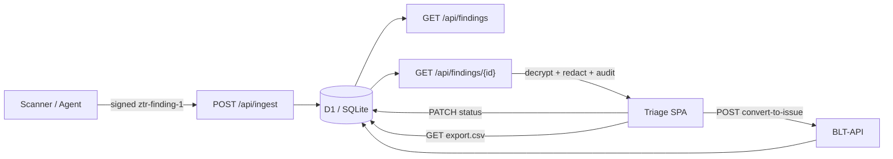

# Midterm Update: Building a Zero-Trust Triage Path for BLT-NetGuardian

**Google Summer of Code 2026 · OWASP BLT · BLT-NetGuardian**  
**Author:** Preetham Poojari · July 2026

> **Archived on the GSoC site:** [gsoc.owaspblt.org/contributors/2026/netguardian/](https://gsoc.owaspblt.org/contributors/2026/netguardian/) — midterm: [midterm.html](https://gsoc.owaspblt.org/contributors/2026/netguardian/midterm.html) · [midterm.md](https://gsoc.owaspblt.org/contributors/2026/netguardian/midterm.md)

---

## The problem we're solving

Security scanners produce findings. Triage teams need to review them, understand the evidence, and turn the important ones into tracked issues — without leaking secrets along the way. In a zero-trust model, that means every finding should arrive **signed**, be stored **encrypted**, and only be decrypted **on authorized view**, with a full audit trail.

At the midterm checkpoint, BLT-NetGuardian now runs that path end-to-end: from signed ingest through encrypted storage, server-side decrypt, triage, and conversion into a BLT issue.

---

## What shipped by midterm

### 1. Signed ingestion (`ztr-finding-1`)

Findings enter through `POST /api/ingest` as `ztr-finding-1` envelopes:

- **HMAC-SHA256** signature over canonical JSON
- **Body digest** (`X-BLT-Body-Digest`) so the wire payload cannot be tampered with
- **Nonce + clock skew** checks for replay protection
- Support for both **plaintext mode** (dev) and **`payload_ciphertext`** (production-shaped)

Ingest rejects bad signatures, digest mismatches, expired timestamps, and replayed nonces with structured error codes — not generic 500s.

### 2. Evidence encryption and decrypt-on-view

This was the biggest midterm gap to close. Evidence payloads can now be stored **AES-256-GCM encrypted at rest**. On `GET /api/findings/{id}`:

1. The server decrypts only for an authorized org token
2. Sensitive keys (`password`, `token`, etc.) are **redacted** before the response leaves the server
3. Access is logged as **`decrypt_view`** (plaintext views log as `view_detail`)

The triage UI shows a badge when evidence was encrypted at rest and successfully decrypted — so analysts can see the cryptographic state, not just the text.

### 3. Triage dashboard (live, same-origin)

The SPA at `/triage.html` is fully wired to the backend:

| Capability | Status |
|------------|--------|
| Org-scoped findings list | ✅ |
| Filters (severity, status, CVE, date range) | ✅ |
| Priority triage queue (open critical/high, no BLT issue) | ✅ |
| Risk-ranked severity sort | ✅ |
| Detail panel (evidence / risk / status tabs) | ✅ |
| Status update via PATCH | ✅ |
| Convert to Issue via **BLT-API** | ✅ |
| CSV export with redaction | ✅ |
| BLT-API health probe in UI | ✅ |

Nothing on the dashboard is decorative — connection status, badges, and actions all reflect real API state.

### 4. BLT-API integration

"Convert to Issue" calls the real BLT-API client. On success, the returned issue ID is stored on the finding and status moves to `converted`. The operation is **idempotent**: converting again returns the existing issue instead of creating duplicates.

### 5. Tests and reproducibility

- **186 tests** passing (ingest verification, crypto roundtrip, encrypted ingest → decrypt e2e, findings API, PATCH, filters, sort)
- Local dev is one command: `python local_dev/serve.py` → open `http://localhost:8787/triage.html` with token `triage-token`
- Optional BLT-API stub on port 8788 for live convert-to-issue demos
- Live-ingest helper: `python local_dev/send_finding.py` posts a fresh signed+encrypted finding through the real pipeline (useful for screen recordings)

---

## Architecture (midterm slice)



**Stack:** Cloudflare Python Worker (`BLTWorker`) + D1-compatible store + static SPA in `public/`. Locally, `serve.py` bridges the same worker logic to an in-memory SQLite stand-in so the full flow is testable without a Cloudflare deploy.

**Security invariants we enforce today:**

- Org isolation on every findings route (Bearer token → `org_id`)
- No plaintext secrets in API responses or CSV export
- Decrypt events are auditable (`decrypt_view` in access logs)
- Ingest never stores raw ciphertext as readable JSON without the wrapper format

---

## Midterm demo flow

The checkpoint from the proposal is:

> signed ingestion → Finding in DB → triage list with filters → server-side decrypt/view evidence → Convert to Issue with CVE autopopulated

That flow is demonstrable today:

1. **Ingest** — seed data or `send_finding.py` posts a signed envelope; server returns `201 created`
2. **List** — triage UI loads org-scoped findings with filters and sort
3. **Detail** — open the encrypted finding (`semgrep.python.sql-injection`); see redacted payload + decrypt badge + audit log
4. **Convert** — click Convert to Issue; BLT-API returns an issue ID; finding status → `converted`
5. **Export** — CSV download with no plaintext secrets

A shot-by-shot recording script lives in the repo: the midterm demo script (local working notes).

---

## Code delivery

Work is in **[MR !12](https://gitlab.com/owasp-blt/blt-netguardian/-/merge_requests/12)** on `owasp-blt/blt-netguardian` (branch `gsoc/evidence-encryption`), including:

1. AES-256-GCM evidence encryption + decrypt-on-view
2. Wording fix for ciphertext ingest validation
3. Findings API hardening (risk-ranked severity sort, deduplicated row mapper, PATCH 400 on bad JSON)

---

## What we intentionally deferred

Honest scope boundaries for the second half of GSoC:

| Item | Why deferred |
|------|----------------|
| **Cloudflare deployment** (Worker + persistent D1) | Final deliverable; local path is reproducible for midterm |
| **Workers WebCrypto adapter** | Local/dev uses Python `cryptography`; port for production runtime |
| **GitHub OAuth / PKCE** | Org Bearer token auth works for midterm; OAuth is a larger auth slice |
| **Flutter desktop client** | Server contracts are stable; client can integrate later |
| **Verified events webhook** | Week 11 milestone |
| **Detection MVP** (Semgrep + HTTP checks) | Week 7–9 milestone |
| **PDF export** | Week 12, timeboxed |

These are schedule choices, not unknowns — the midterm slice is the **trust + triage backbone**; the second half adds scanners, events, deployment, and polish.

---

## Lessons learned

1. **Sort by meaning, not alphabet.** Severity is a category. Lexical sort put `medium` above `critical`. We fixed it with an explicit risk rank in SQL — a small bug that would have confused every analyst using "Severity (high first)."

2. **One source of truth for API shapes.** The finding object was duplicated in three places. Consolidating to `finding_row_to_item()` prevented detail and PATCH from drifting apart.

3. **Demo contrast beats demo decoration.** Seeding one encrypted and two plaintext findings lets you *show* decrypt-on-view is real (badge + `decrypt_view` audit) instead of claiming it in slides.

4. **Same-origin local dev matters.** Serving the SPA from `serve.py` (not `file://` or a separate Live Server) avoids CORS/auth confusion and matches how the Worker will serve `public/` in production.

---

## What's next (Weeks 7–12)

- Merge MR !12 and deploy to Cloudflare with persistent D1
- Detection pack: Semgrep rules + HTTP checks feeding the ingest pipeline
- GitHub OAuth for triage sessions
- Verified events for Rewards / RepoTrust downstream
- Flutter client against the stable ingest contract
- Pilot with a first org and metrics (time-to-triage, FP/FN on fixtures)

---

## Try it yourself

```bash
git clone https://gitlab.com/owasp-blt/blt-netguardian.git
cd blt-netguardian
git checkout gsoc/evidence-encryption
python3 -m venv .venv && .venv/bin/pip install -r requirements.txt

# Terminal A
.venv/bin/python local_dev/blt_api_stub.py

# Terminal B
.venv/bin/python local_dev/serve.py
```

Open **http://localhost:8787/triage.html** · token: `triage-token`

Post a live finding:

```bash
.venv/bin/python local_dev/send_finding.py
```

Refresh the UI — a new `zap.ssrf` critical finding should appear, encrypted at rest.

---

## Links

- Repo: [gitlab.com/owasp-blt/blt-netguardian](https://gitlab.com/owasp-blt/blt-netguardian)
- Midterm MR: [!12 — Evidence encryption + findings API hardening](https://gitlab.com/owasp-blt/blt-netguardian/-/merge_requests/12)
- Production (future): [netguardian.owaspblt.org](https://netguardian.owaspblt.org)

---

*Questions or feedback welcome on the MR or OWASP BLT channels.*